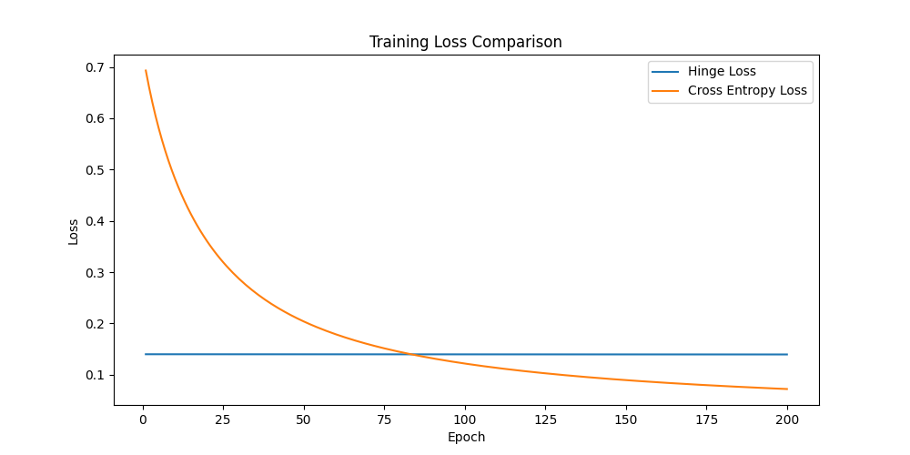

# SVM 实验报告
## 基本信息
学号：22336018
姓名：蔡可豪

## 实验要求

1) 考虑两种不同的核函数：i) 线性核函数; ii) 高斯核函数 
2) 可以直接调用现成SVM 软件包来实现 
3) 手动实现采用hinge loss 和cross-entropy loss 的线性分类模型，并比较它们的优劣

实验报告需包含（但不限于）: 
1） SVM 模型的一般理论 
2） 采用不同核函数的模型和性能比较及分析 
3） 采用hinge loss 的线性分类模型和SVM 模型之间的关系 
4） 采用hinge loss 线性分类模型和cross-entropy loss 线性分类模型比较 
5） 训练过程（包括初始化方法、超参数参数选择、用到的训练技巧等） 
6） 实验结果、分析及讨论

# 实验结果

## 1 SVM 模型的一般理论
其实最主要的理论就是三点。其余所有的内容都是围绕着这三点展开的。
1. 寻找最优超平面来分割不同类别的数据点
2. 最大化分类间隔
3. 支持线性和非线性分类（维度拓展）

软间隔和硬间隔的区别在于是否允许分类错误。本质上都是为了最大化间隔。只不过采取了不同的惩罚措施。
所以后面的所有内容基本都围绕着这三点进行展开。
## 2 采用不同核函数的模型和性能比较及分析
线性核分类模型：
```python
linear_svm = SVC(kernel='linear')
```
高斯核分类模型：
```python
rbf_svm = SVC(kernel='rbf')
```
主要差异在于线性核适用于线性可分的数据集，而高斯核适用于线性不可分的数据集。
因为高斯核采用了径向基函数，所以可以很好地处理非线性问题。
下面查看实验结果，完整代码实现见`Project-1-SVM/Linear_RBF_Comparation/main.py`


如图为准确率的比较。线性模型准确率和RBF模型准确率相差不大。或者说基本没有相差。
可见对于这个给定的数据集，线性模型就够用了。
下面比较训练时间和预测时间。


发现线性模型不管是在 Training 还是 Prediction 都比 RBF 模型要快。
因为知道理论上来说，Linear 训练的时间复杂度是 O(n)，而 RBF 模型的时间复杂度是 O(n^2)。计算量级相差很大。


这张图片是 ROC 曲线的比较。虚线是基准线，是无预测模型。
可以看到我们训练的模型都在`y = 1`的位置上。说明训练的非常好。(橙色被绿色挡住了，因为准确率比较接近。)

## 3 采用hinge loss 的线性分类模型和SVM 模型之间的关系
数学上来说，这两个模型关系还是比较密切的。
SVM的原始优化目标相同，都是最大化间隔，最小化分类错误。所以在数学上目标是等价的。只是实现方式有差异。

主要区别在于：
1. SVM 采用了核函数，所以可以处理非线性问题。而 hinge loss 线性分类模型只能处理线性问题。
2. SVM 的解是稀疏的，而 hinge loss 线性分类模型的解是稠密的。

## 4 采用hinge loss 线性分类模型和cross-entropy loss 线性分类模型比较
核心代码：`Project-1-SVM/Loss_Func_Comp/main.py`
部分关键实现：
```python
# Hinge Loss 分类器实现
class LinearClassifierHinge:
    def __init__(self, learning_rate=0.001, epochs=100, C=1.0):
        # 初始化分类器参数
        self.learning_rate = learning_rate  # 学习率
        self.epochs = epochs  # 训练轮数
        self.C = C  # 正则化参数

    def fit(self, X, y):
        # 训练模型
        X = np.array(X)
        y = np.array(y)
        n_samples, n_features = X.shape
        self.w = np.random.randn(n_features) * 0.01  # 初始化权重
        self.b = 0  # 初始化偏置
        self.loss_history = []  # 记录损失历史
        self.time_per_epoch = []  # 记录每个epoch的训练时间

        for epoch in range(self.epochs):
            epoch_start_time = time.time()
            # 随机打乱训练数据
            indices = np.arange(n_samples)
            np.random.shuffle(indices)
            X_shuffled = X[indices]
            y_shuffled = y[indices]

            for i in range(n_samples):
                xi = X_shuffled[i]
                yi = y_shuffled[i]
                # 判断是否满足 margin 条件
                condition = yi * (np.dot(xi, self.w) + self.b) < 1
                if condition:
                    # 更新梯度（违反 margin 条件）
                    grad_w = self.w - self.C * yi * xi
                    grad_b = -self.C * yi
                else:
                    # 更新梯度（满足 margin 条件）
                    grad_w = self.w
                    grad_b = 0
                # 更新权重和偏置
                self.w -= self.learning_rate * grad_w
                self.b -= self.learning_rate * grad_b

            # 计算 hinge loss
            distances = 1 - y * (np.dot(X, self.w) + self.b)
            distances = np.maximum(0, distances)
            hinge_loss = self.C * np.mean(distances)
            # 计算总损失（包括正则化项）
            loss = 0.5 * np.dot(self.w, self.w) + hinge_loss
            self.loss_history.append(loss)

            epoch_end_time = time.time()
            self.time_per_epoch.append(epoch_end_time - epoch_start_time)

            # 每10轮打印一次损失
            if (epoch + 1) % 10 == 0:
                print(f"Epoch {epoch+1}/{self.epochs}, Loss: {loss}")

    def predict(self, X):
        # 预测样本类别
        return np.sign(np.dot(X, self.w) + self.b)
```

```python
# Cross Entropy Loss 分类器实现
class LinearClassifierCrossEntropy:
    def __init__(self, learning_rate=0.001, epochs=100):
        self.learning_rate = learning_rate
        self.epochs = epochs
        
    def sigmoid(self, z):
        # 避免数值溢出
        z = np.clip(z, -500, 500)
        return 1 / (1 + np.exp(-z))
    
    def fit(self, X, y):
        X = np.array(X)
        y = np.array(y)
        n_samples, n_features = X.shape
        self.w = np.random.randn(n_features) * 0.01
        self.b = 0
        self.loss_history = []
        self.time_per_epoch = []
        
        for epoch in range(self.epochs):
            epoch_start_time = time.time()
            # 前向传播
            z = np.dot(X, self.w) + self.b
            y_pred = self.sigmoid(z)
            
            # 计算交叉熵损失
            epsilon = 1e-15  # 防止log(0)
            loss = -np.mean(y * np.log(y_pred + epsilon) + (1 - y) * np.log(1 - y_pred + epsilon))
            self.loss_history.append(loss)
            
            # 反向传播
            dz = y_pred - y
            dw = (1 / n_samples) * np.dot(X.T, dz)
            db = (1 / n_samples) * np.sum(dz)
            
            # 更新参数
            self.w -= self.learning_rate * dw
            self.b -= self.learning_rate * db
            
            epoch_end_time = time.time()
            self.time_per_epoch.append(epoch_end_time - epoch_start_time)
            
            if (epoch + 1) % 10 == 0:
                print(f"Epoch {epoch+1}/{self.epochs}, Loss: {loss}")
                
    def predict(self, X):
        z = np.dot(X, self.w) + self.b
        y_pred = self.sigmoid(z)
        return (y_pred >= 0.5).astype(int)
```

其核心差异在于损失函数。Hinge Loss 是 0-1 损失函数的上界，所以其优化目标和 SVM 一致。
而 Cross Entropy Loss 是逻辑回归的损失函数，优化目标和 SVM 不一致。
具体体现在代码中：
- Hinge Loss 的梯度更新中，只更新违反 margin 条件的样本的梯度。
- Cross Entropy Loss 的梯度更新中，所有样本的梯度都会被更新。
```python
if condition:
    # 更新梯度（违反 margin 条件）
    grad_w = self.w - self.C * yi * xi
    grad_b = -self.C * yi
```
以及
```python
dz = y_pred - y
```
所以理论上来说，Hinge Loss 的收敛速度会比 Cross Entropy Loss 快。不过这个还是要看具体的参数设置。
而使用 Cross Entropy Loss 的模型，其预测结果是概率值。所以需要设置一个阈值来判断类别。一般在二分类的话就是 0.5。

下面查看训练结果，完整代码实现见`Project-1-SVM/Loss_Func_Comp/main.py`


可以看到 HingeLoss 在一开始就迅速下降，而 Cross Entropy Loss 在稍微晚一点才迅速下降。
而对于每个Epoch的训练时间，可以看到 HingeLoss 的训练时间明显比 Cross Entropy Loss 要长。
这是为什么呢？可能是因为具体实现的时候，HingeLoss 写的时候用的是 for-Loop，效率上会比 Cross Entropy Loss 慢。
后面改写了一下，使用 numpy 向量化计算，时间上快了很多。
下面是更新后的代码
```python
# 向量化计算预测值
scores = np.dot(X, self.w) + self.b
# 计算 margin 违反条件的样本
margin = y * scores
mask = margin < 1
```
但是发现 Hinge 的 Loss 越训越大
```text
Training Hinge Loss Classifier...
Epoch 10/200, Loss: 0.24978032602989952
Epoch 20/200, Loss: 0.26955025689900125
Epoch 30/200, Loss: 0.2850211809448148
Epoch 40/200, Loss: 0.29855083376505775
Epoch 50/200, Loss: 0.3111656615712255
Epoch 60/200, Loss: 0.32209344935147366
Epoch 70/200, Loss: 0.3315384096128725
Epoch 80/200, Loss: 0.3404659517723696
Epoch 90/200, Loss: 0.348606228254739
Epoch 100/200, Loss: 0.3562200925420947
Epoch 110/200, Loss: 0.36375533565090235
Epoch 120/200, Loss: 0.3708112628234621
Epoch 130/200, Loss: 0.37759944099983295
Epoch 140/200, Loss: 0.38400181450569704
Epoch 150/200, Loss: 0.39026349881983025
Epoch 160/200, Loss: 0.3961838645360586
Epoch 170/200, Loss: 0.4016471579104505
Epoch 180/200, Loss: 0.40697822206019707
Epoch 190/200, Loss: 0.412247229888245
Epoch 200/200, Loss: 0.41746496990094967
```

经过仔细检查，问题出在梯度计算的**缩放比例（scaling）**上。

在代码中，损失函数中的hinge损失是按样本的平均值计算的：

```python
hinge_loss = self.C * np.mean(distances)
```
然而，在计算梯度时，使用了对违反margin条件的样本的总和，而不是平均值：

```python
grad_w = self.w - self.C * np.sum(y[mask].reshape(-1, 1) * X[mask], axis=0)
grad_b = -self.C * np.sum(y[mask])
```
这种不一致会导致梯度的尺度（scale）与损失函数不匹配，从而影响模型的学习效果。
后来改正后正确下降了。而且在一开始就达到了较低的 loss。 并且训练时间也大大缩短。



## 5 训练过程（包括初始化方法、超参数参数选择、用到的训练技巧等）
对于`Hinge Loss`的模型，初始化方法对训练的影响不大。 
选择用正态分布随机初始化 w，并且乘以 0.01 来避免初始化权重过大。同时可以兼顾打破对称性，使得模型可以学习到不同的特征.
而偏置参数则直接设置为 0.
```python
self.w = np.random.randn(n_features) * 0.01  # 初始化权重
self.b = 0  # 初始化偏置
```

对于`Cross Entropy Loss`的模型，初始化方法对训练的影响较大。所以采取了一种比较保守的方式。
直接设置初始化为 0。
而偏置参数则直接设置为 0.
```python
self.w = np.zeros(n_features)  # 初始化权重
self.b = 0  # 初始化偏置
```

对于超参数的选择，主要在于学习率和正则化参数。
其中学习率目的在于控制模型更新的步长。如果设置的过大，会导致模型不收敛。如果设置的过小，会导致训练时间过长。
正则化参数则是控制模型的复杂度。如果设置的过大，会导致模型过于简单，甚至欠拟合。如果设置的过小，会导致模型过于复杂，甚至过拟合。

于是进行网格搜索，完整代码见`Project-1-SVM/Loss_Func_Comp/GridSearch.py`
搜索空间为
```python
    # Hinge Loss 网格搜索参数
    hinge_params = {
        'learning_rate': [1e-5, 1e-4, 1e-3],
        'epochs': [100, 200],
        'C': [0.01, 0.1, 1.0]
    }
    
    # Cross Entropy Loss 网格搜索参数
    ce_params = {
        'learning_rate': [0.001, 0.01, 0.1],
        'epochs': [100, 200]
    }
```

搜索结果为
```text
Best Hinge Loss Parameters: {'learning_rate': 0.001, 'epochs': 200, 'C': 1.0, 'accuracy': 0.9990539262062441}
Best Cross Entropy Loss Parameters: {'learning_rate': 0.1, 'epochs': 100, 'accuracy': 0.9990539262062441}
```

## 6 实验结果、分析及讨论
 文档前面的内容都包含了实验结果分析以及讨论。这里不做多赘述。