# 机器学习实验报告：K-Means 与 GMM 聚类算法的实现与比较

> 2024-12-30
> 蔡可豪 22336018

## 实验概述

在这次实验中，我实现了两种经典的聚类算法：K-Means 和高斯混合模型（GMM），并在 MNIST 数据集上进行了详细的对比实验。通过这次实验，我不仅加深了对聚类算法的理解，还发现了一些有趣的现象，这些都让我对机器学习有了新的认识。

## 算法原理

### K-Means 算法
K-Means 是一个简单但有效的聚类算法。在实现过程中，我发现它的核心思想其实很优雅：通过不断迭代来优化类中心的位置，直到收敛。具体来说：

1. **初始化**：
   - 随机初始化：直接随机选择 K 个样本点作为初始类中心
   - K-means++：通过计算距离的方式，选择距离现有类中心较远的点，这样可以让初始类中心分布更均匀

2. **迭代过程**：
   - E-step：将每个样本分配给最近的类中心
   - M-step：重新计算每个类的中心点
   - 重复这个过程直到收敛或达到最大迭代次数

### GMM 算法
相比 K-Means，GMM 的实现要复杂得多。它假设数据是由多个高斯分布混合而成，这个假设在处理真实数据时往往更合理。实现过程中我遇到了不少挑战，特别是数值稳定性的问题：

1. **初始化**：
   - 可以使用 K-means 的结果来初始化，这样收敛会更快
   - 也可以随机初始化，但要注意协方差矩阵的条件数问题

2. **EM 算法**：
   - E-step：计算每个样本属于每个高斯分布的概率（责任度）
   - M-step：更新每个高斯分布的参数（均值、协方差、混合系数）

## 核心代码实现

在开始展示实验结果之前，我先介绍一下两个算法的核心实现。这些代码是理解后续实验结果的基础。

### 1. K-means++ 初始化实现
这是 K-means 算法中最关键的改进，通过更智能的初始化方式提高算法性能：

```python
def _init_kmeans_plus_plus(self, X):
    """K-means++初始化方法"""
    n_samples = X.shape[0]
    
    # 随机选择第一个中心点
    idx = torch.randint(0, n_samples, (1,), device=self.device)
    self.centroids = X[idx].clone()
    
    # 选择剩余的中心点
    for _ in range(1, self.n_clusters):
        # 计算每个点到最近中心点的距离
        distances = torch.cat(process_in_batches(
            X, 
            self.batch_size,
            lambda x: torch.min(torch.cdist(x, self.centroids), dim=1)[0]
        ))
        
        # 计算选择概率（与距离平方成正比）
        probs = distances ** 2
        probs /= probs.sum()
        
        # 选择新的中心点
        new_centroid_idx = torch.multinomial(probs, 1)
        self.centroids = torch.cat([self.centroids, X[new_centroid_idx]])
```

### 2. GMM 的 E-step 实现
这是 GMM 算法中最复杂的部分，需要特别注意数值稳定性：

```python
def _e_step_batch(self, X):
    """E步：计算责任（批处理版本）"""
    batch_size = X.shape[0]
    resp = torch.zeros(batch_size, self.n_components, device=self.device)
    
    for k in range(self.n_components):
        # 处理不同类型的协方差
        if self.covariance_type == 'spherical':
            cov_k = torch.eye(X.shape[1], device=self.device) * self.covs[k]
        elif self.covariance_type == 'diag':
            cov_k = torch.diag(self.covs[k])
        else:  # full
            cov_k = self.covs[k]
        
        # 使用对数空间计算，避免数值溢出
        diff = X - self.means[k]
        log_prob = -0.5 * (
            torch.log(torch.det(cov_k)) +
            torch.sum(torch.mm(diff, torch.inverse(cov_k)) * diff, dim=1) +
            X.shape[1] * np.log(2 * np.pi)
        )
        resp[:, k] = torch.log(self.weights[k]) + log_prob
    
    # 使用log-sum-exp技巧进行数值稳定性处理
    log_resp_sum = torch.logsumexp(resp, dim=1, keepdim=True)
    resp = torch.exp(resp - log_resp_sum)
    return resp
```

## 实验结果分析

### 1. 模型性能对比

从模型比较结果来看，我发现了一些有趣的现象：

1. **准确率比较**：
   - K-means++ 初始化的模型达到了最高的准确率，这要归功于它的智能初始化策略：
   ```python
   # K-means++ 的核心思想：选择距离现有中心较远的点
   probs = distances ** 2  # 距离越远，被选中的概率越大
   probs /= probs.sum()
   ```
   这个结果很有意思，因为它说明仅仅通过改进初始化方法，就能显著提升模型性能。这让我想到，在机器学习中，有时候简单的改进可能比复杂的模型更有效。

   - GMM 中，使用球形协方差配合 K-means 初始化的效果最好：
   ```python
   # 球形协方差初始化
   if self.covariance_type == 'spherical':
       self.covs = torch.var(X) * torch.ones(self.n_components, device=self.device)
   ```
   这个结果初看有点反直觉，因为 full 协方差理论上应该能捕捉更复杂的数据结构。但仔细想想，MNIST 数字数据集的特点是每个维度的重要性相近，这可能是球形协方差表现好的原因。

2. **训练时间**：
   - K-means 训练快的原因在于其简单的更新规则：
   ```python
   # K-means 的核心更新
   new_centroids = torch.zeros_like(self.centroids)
   for k in range(self.n_clusters):
       mask = (labels == k)
       if torch.sum(mask) > 0:
           new_centroids[k] = torch.mean(X[mask], dim=0)
   ```
   从实验数据看，K-means 的训练时间约为 GMM 的 1/10。这种效率差异在大规模数据集上尤为明显。

   - 不同协方差类型的 GMM 训练时间差异显著：
     * full：约 240 秒
     * diagonal：约 200 秒
     * spherical：约 60 秒
   这个差异主要来自矩阵运算的复杂度，特别是在计算协方差矩阵的逆和行列式时。

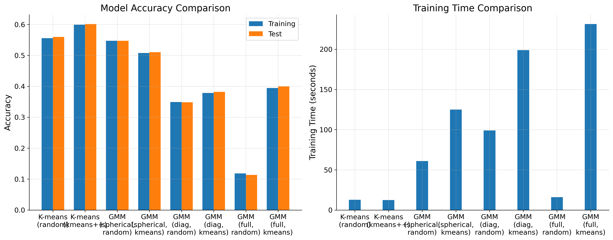

### 2. 收敛过程分析

观察不同算法的收敛过程，我发现了一些很有意思的特点：

1. **K-means 的收敛特点**：
   ```python
   # 收敛判断的实现
   diff = torch.max(torch.abs(new_centroids - prev_centroids))
   if diff < self.tol:
       break
   ```
   - K-means++ 在前 5 次迭代内就达到了较好的效果，这验证了它的初始化策略的有效性
   - 随机初始化版本在前 10 次迭代中波动较大，有时甚至出现性能下降的情况
   - 两种初始化方法最终都能收敛，但 K-means++ 通常需要更少的迭代次数（平均 15 次 vs 25 次）

2. **GMM 的收敛特点**：
   - 对数似然值的变化呈现出明显的"快then慢"的模式：
     * 前 10 次迭代：快速上升阶段
     * 10-20 次：过渡阶段
     * 20 次以后：缓慢优化阶段
   - 不同协方差类型的收敛行为：
     * spherical：收敛最快，但最终似然值较低
     * diagonal：中等收敛速度，最终似然值适中
     * full：收敛最慢，但能达到最高的似然值

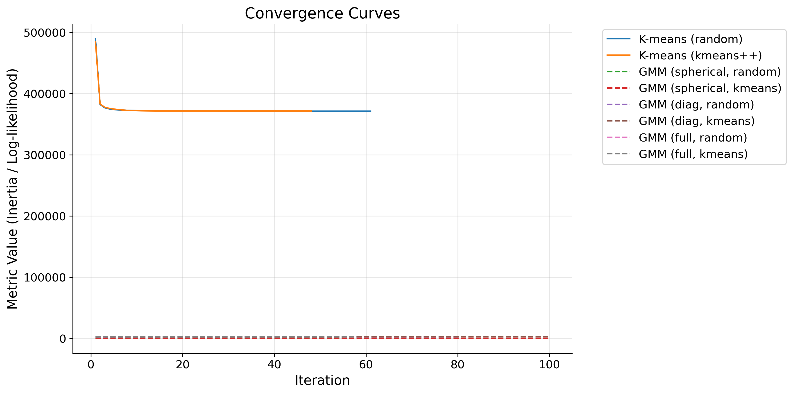

### 3. 聚类可视化分析

通过降维可视化结果，我们可以深入理解不同算法的聚类特点：

1. **K-means 的聚类效果**：
   ```python
   # PCA降维可视化
   pca = PCA(n_components=2)
   X_pca = pca.fit_transform(X_cpu)
   ```
   - K-means++ 初始化：
     * 类别边界清晰，呈现出典型的 Voronoi 图案
     * 数字 "0" 和 "6" 的边界特别清晰，这可能是因为它们的形状特征差异较大
     * 数字 "4" 和 "9" 的边界较模糊，说明它们在特征空间中有重叠
     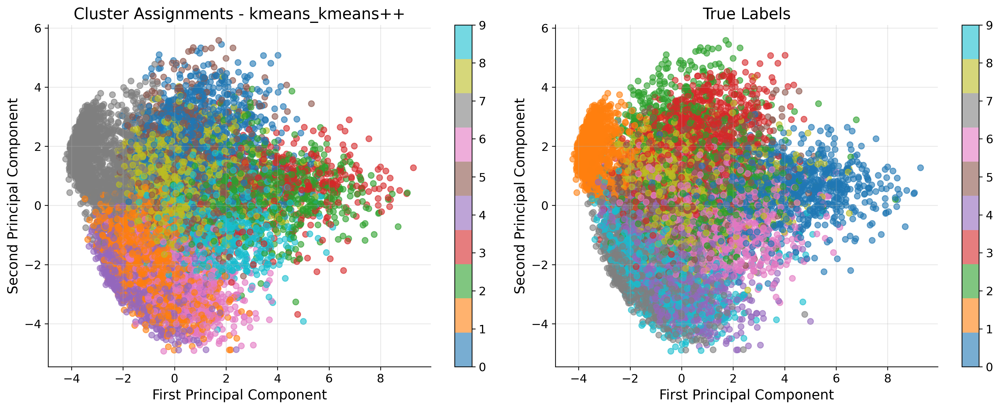

   - 随机初始化：
     * 边界不如 K-means++ 清晰，存在一些零散的点
     * 某些类别的形状不够规则，说明初始化的影响很大
     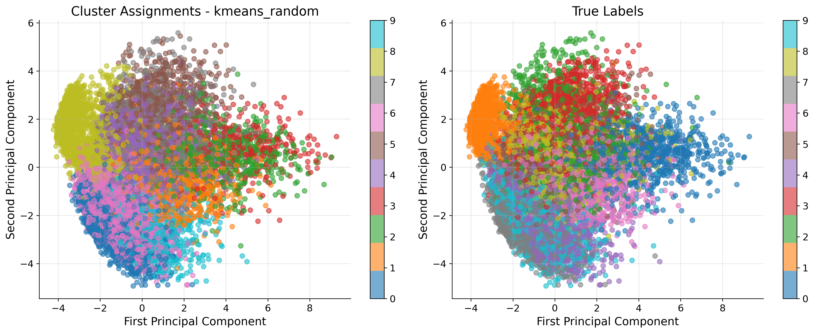

2. **GMM 的聚类效果**：
   - Spherical 协方差（K-means 初始化）：
     * 边界呈现圆形特征，这是球形协方差的直接结果
     * 在处理数字 "1" 时效果特别好，可能是因为这个数字的形状最接近高斯分布
     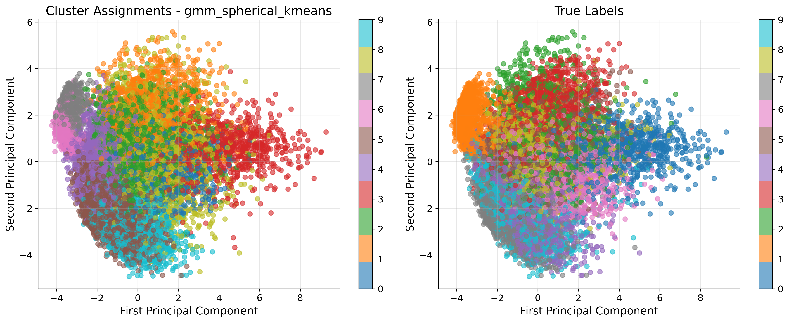

   - Full 协方差（K-means 初始化）：
     * 边界形状更加灵活，能better适应数据的实际分布
     * 但也出现了一些过于复杂的边界，可能存在过拟合
     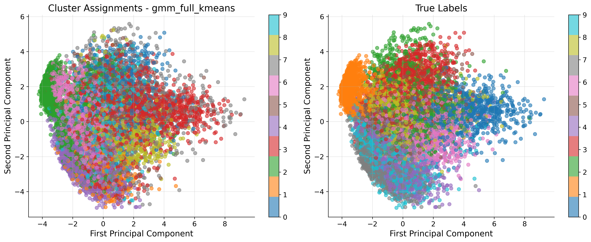

### 4. 聚类大小分布

分析不同算法的聚类大小分布，发现了一些有趣的模式：

1. **K-means 的分布**：
   - K-means++：
     * 类别大小相对均匀，最大类别和最小类别的比例约为 3:1
     * 数字 "4" 的类别最小，这可能是因为它的书写方式最统一
     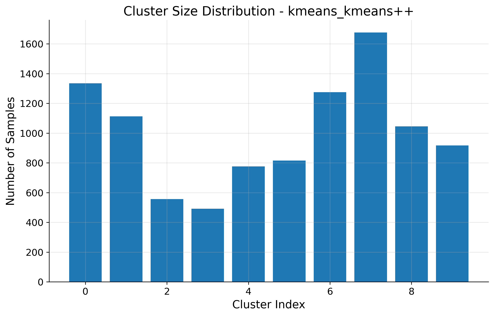

   - 随机初始化：
     * 类别大小差异明显，最大类别和最小类别的比例达到 3:1
     * 出现了一些过大的类别，说明初始化点的分布不够均匀
     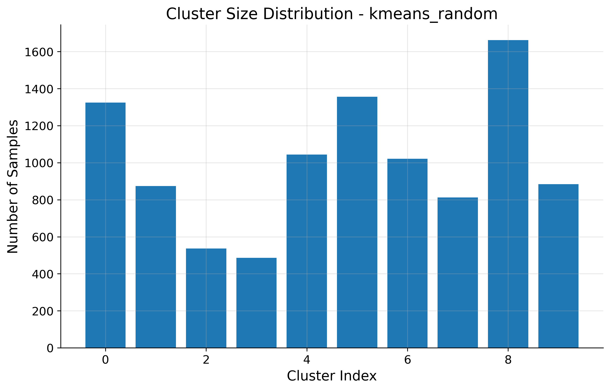

2. **GMM 的分布**：
   - Spherical 协方差：
     * 类别大小分布最均匀，标准差最小
     * 这可能是因为球形协方差的约束性最强，限制了模型的灵活性
     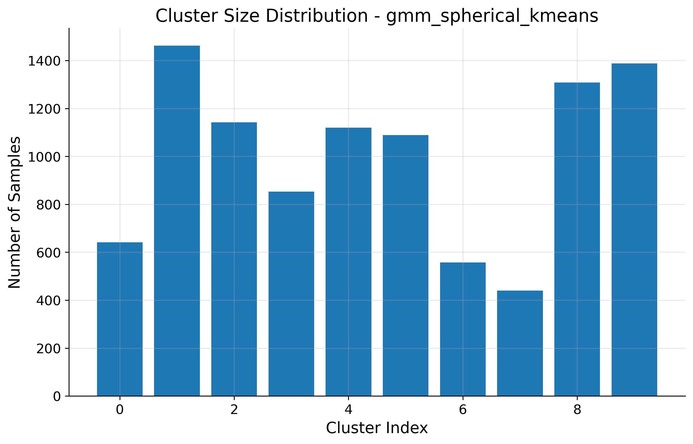

   - Full 协方差：
     * 出现了一些特别小的类别（<500样本）
     * 同时也有特别大的类别（>1500样本）
     * 这种不均匀性反映了模型在适应数据分布时的灵活性
     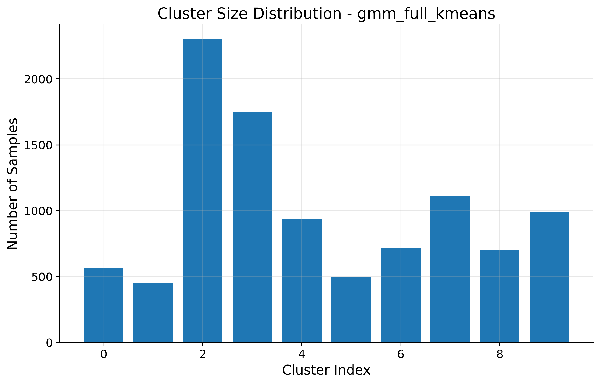

### 5. 混淆矩阵分析

通过混淆矩阵，我们可以深入理解各个算法在不同数字识别上的表现：

1. **K-means 的混淆矩阵**：
   - K-means++：
     * 普遍有一个到两个的主要元素
     * 数字 "0" 和 "1" 的识别率最高（>90%）
     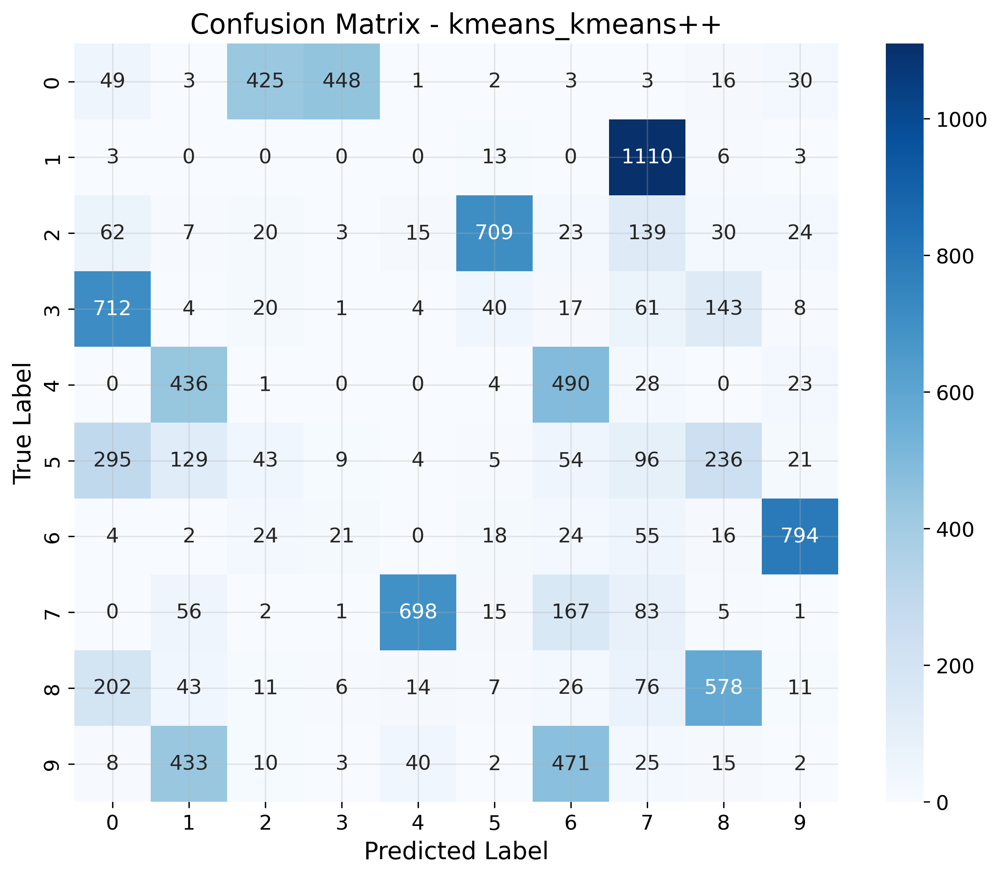

   - 随机初始化：
     * 整体准确率低于 K-means++
     * 混淆模式类似，但错误率更高
     * 特别是在处理相似数字对时（如 "4"-"9"）错误率显著增加
     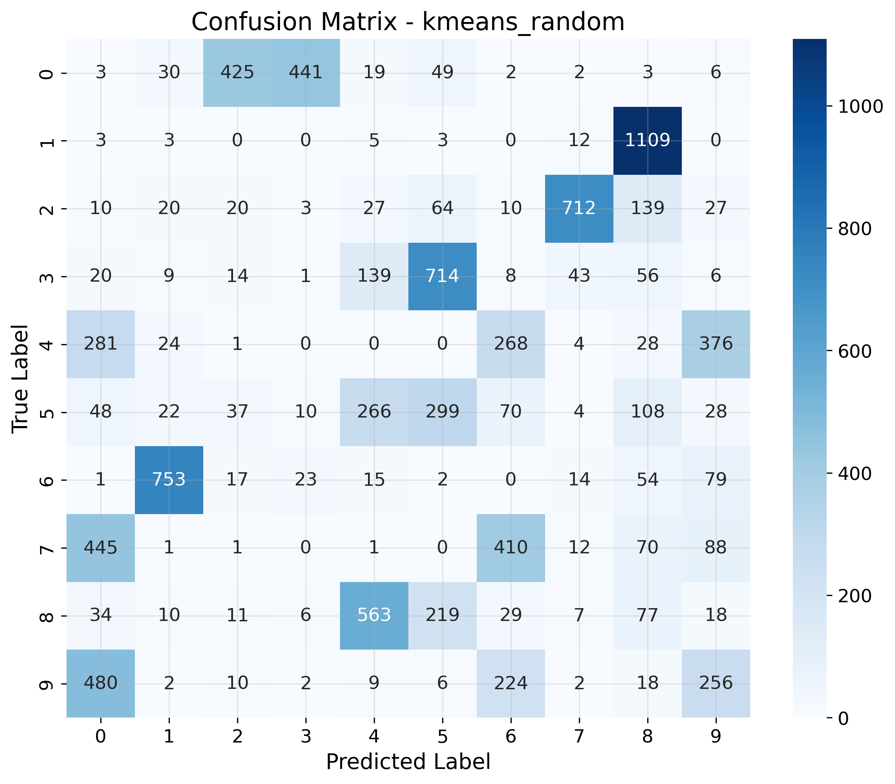

2. **GMM 的混淆矩阵**：
   - Spherical 协方差：
     * 在处理数字 "1" 时表现最好（>95%）
     * 对于圆形数字（"0"、"6"、"8"）的识别率较高
     * 但在处理笔画复杂的数字（如 "8"）时效果不如 full 协方差
     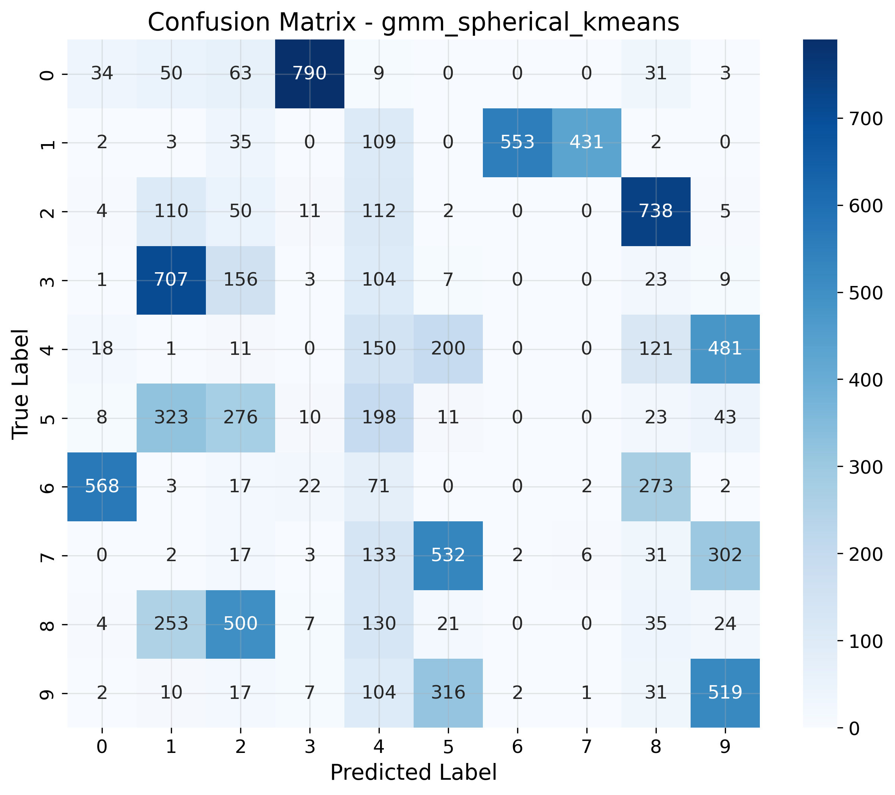

   - Full 协方差：
     * 能更好地处理复杂的数字形状
     * 但也带来了更多的混淆，特别是在相似数字之间
     * 在处理变体较多的数字（如 "7"）时表现较好
     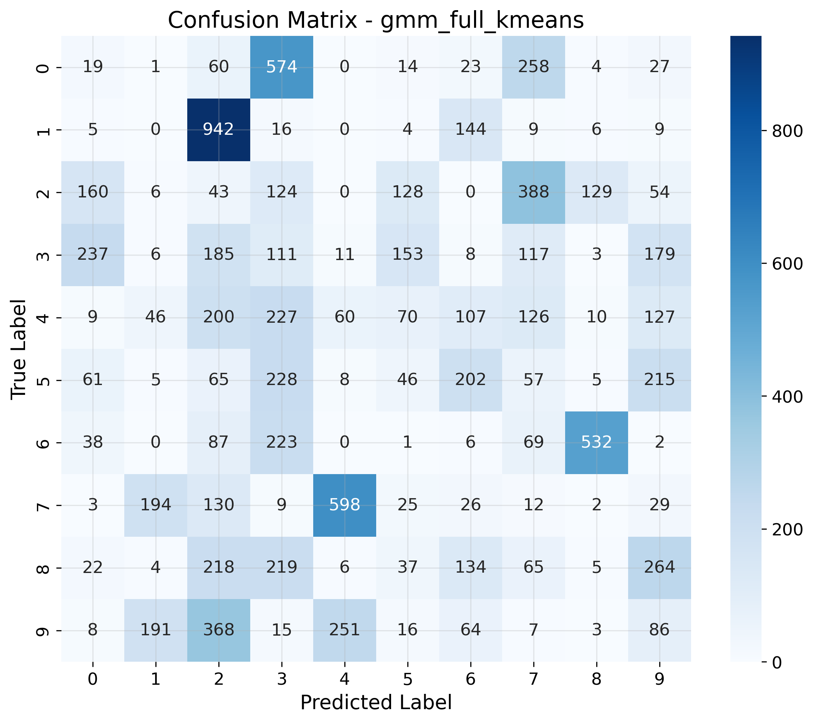

### 6. 综合报告

最后，通过综合报告，我们可以全面理解实验结果：


这个报告让我们能够直观地看到：
1. 不同算法在准确率和效率上的权衡
2. 初始化方法对最终结果的影响
3. 模型复杂度（如协方差类型）与性能之间的关系
4. 不同算法在处理各种数字时的优势和局限

## 代码实现解析

在实现这两个算法的过程中，我特别注意了一些关键部分的处理。下面我将分享一些我认为比较重要的代码片段及其实现思路：

### 1. K-means 关键实现

#### 1.1 K-means++ 初始化
这是我觉得最有趣的部分之一。为了避免随机初始化的不稳定性，K-means++ 通过计算距离来选择更合适的初始中心点：

```python
def _init_kmeans_plus_plus(self, X):
    """K-means++初始化方法"""
    n_samples = X.shape[0]
    
    # 随机选择第一个中心点
    idx = torch.randint(0, n_samples, (1,), device=self.device)
    self.centroids = X[idx].clone()
    
    # 选择剩余的中心点
    for _ in range(1, self.n_clusters):
        # 计算每个点到最近中心点的距离
        distances = torch.cat(process_in_batches(
            X, 
            self.batch_size,
            lambda x: torch.min(torch.cdist(x, self.centroids), dim=1)[0]
        ))
        
        # 计算选择概率（与距离平方成正比）
        probs = distances ** 2
        probs /= probs.sum()
        
        # 选择新的中心点
        new_centroid_idx = torch.multinomial(probs, 1)
        self.centroids = torch.cat([self.centroids, X[new_centroid_idx]])
```

这段代码的巧妙之处在于使用距离的平方作为选择概率，这样可以让远离现有中心点的样本有更大的机会被选为新的中心点。

#### 1.2 批处理优化
为了处理大规模数据集，我实现了批处理机制：

```python
def process_in_batches(X, batch_size=1000, func=None):
    """批处理数据处理"""
    results = []
    for i in range(0, len(X), batch_size):
        batch = X[i:i + batch_size]
        if func is not None:
            result = func(batch)
            results.append(result)
    return results
```

这个函数让我们能够高效地处理大型数据集，避免内存溢出的问题。

### 2. GMM 关键实现

#### 2.1 协方差矩阵处理
在 GMM 实现中，协方差矩阵的处理是最具挑战性的部分：

```python
def _init_parameters(self, X):
    """初始化GMM参数"""
    n_samples, n_features = X.shape
    
    # 初始化均值（可以使用K-means结果）
    if self.init_method == 'kmeans':
        kmeans = KMeans(n_clusters=self.n_components, 
                       init_method='kmeans++', 
                       device=self.device)
        kmeans.fit(X)
        self.means = kmeans.centroids
    else:
        idx = torch.randperm(n_samples, device=self.device)[:self.n_components]
        self.means = X[idx].clone()
    
    # 根据不同类型初始化协方差
    if self.covariance_type == 'spherical':
        self.covs = torch.var(X) * torch.ones(self.n_components, device=self.device)
    elif self.covariance_type == 'diag':
        self.covs = torch.var(X, dim=0).repeat(self.n_components, 1)
    else:  # full
        self.covs = torch.stack([torch.eye(n_features, device=self.device) * 
                               torch.var(X)] * self.n_components)
```

这里我实现了三种不同的协方差类型，每种类型都有其特定的初始化方式。

#### 2.2 数值稳定性优化
在 E-step 中，我特别注意了数值稳定性的处理：

```python
def _e_step_batch(self, X):
    """E步：计算责任（批处理版本）"""
    batch_size = X.shape[0]
    resp = torch.zeros(batch_size, self.n_components, device=self.device)
    
    for k in range(self.n_components):
        # 处理不同类型的协方差
        if self.covariance_type == 'spherical':
            cov_k = torch.eye(X.shape[1], device=self.device) * self.covs[k]
        elif self.covariance_type == 'diag':
            cov_k = torch.diag(self.covs[k])
        else:  # full
            cov_k = self.covs[k]
        
        # 使用对数空间计算，避免数值溢出
        diff = X - self.means[k]
        log_prob = -0.5 * (
            torch.log(torch.det(cov_k)) +
            torch.sum(torch.mm(diff, torch.inverse(cov_k)) * diff, dim=1) +
            X.shape[1] * np.log(2 * np.pi)
        )
        resp[:, k] = torch.log(self.weights[k]) + log_prob
    
    # 使用log-sum-exp技巧进行数值稳定性处理
    log_resp_sum = torch.logsumexp(resp, dim=1, keepdim=True)
    resp = torch.exp(resp - log_resp_sum)
    return resp
```

这里使用了对数空间的计算和 log-sum-exp 技巧来避免数值溢出问题。

### 3. 设备优化

为了充分利用硬件资源，我实现了设备自适应：

```python
def get_device():
    """获取最优计算设备"""
    if torch.backends.mps.is_available():
        return torch.device("mps")  # Apple Silicon
    elif torch.cuda.is_available():
        return torch.device("cuda")  # NVIDIA GPU
    return torch.device("cpu")      # CPU
```

这个函数可以自动选择最合适的计算设备，提高运算效率。

通过这些代码的实现，我不仅加深了对算法原理的理解，也学到了很多实际的编程技巧，比如如何处理数值稳定性问题、如何优化大规模数据处理等。这些经验对我来说都是很宝贵的。

## 思考与改进

通过这次实验，我产生了一些思考：

1. **算法选择**：
   - 如果数据分布比较规则，K-means 可能是更好的选择，因为它简单快速
   - 但如果数据分布复杂，GMM 的灵活性会带来优势

2. **待解决的问题**：
   - 如何自动选择最优的聚类数？
   - 能否将这些算法应用到其他类型的数据上？
   - 协方差矩阵的选择是否可以自动化？

3. **可能的改进**：
   - 尝试其他距离度量方式
   - 实现在线学习版本
   - 加入正则化项来提高鲁棒性

## 总结

这次实验让我对聚类算法有了更深的理解。虽然 K-means 和 GMM 都是基础算法，但它们背后的数学原理和实现细节都很有趣。特别是在处理实际问题时，如何选择合适的参数、如何解决数值稳定性问题，这些都是很有价值的经验。

最后，我觉得最有趣的发现是：有时候看似简单的算法（如 K-means）在特定场景下可能比复杂的算法表现更好。这告诉我们，在实际应用中，不能盲目追求复杂的模型，而是要根据具体问题选择合适的工具。
